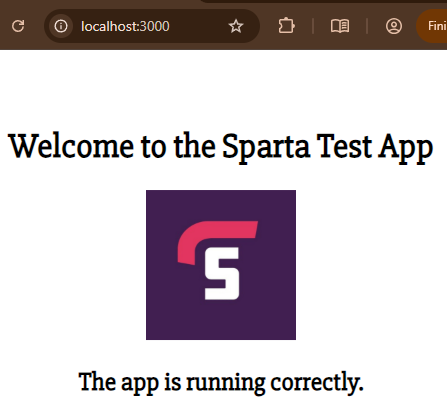
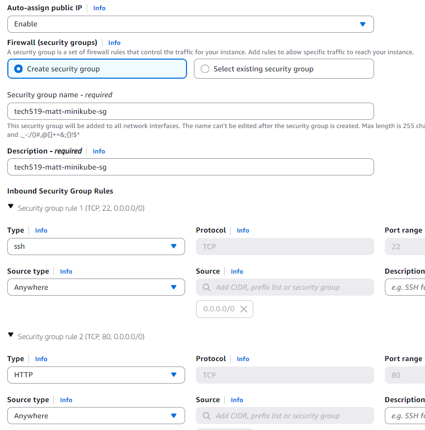
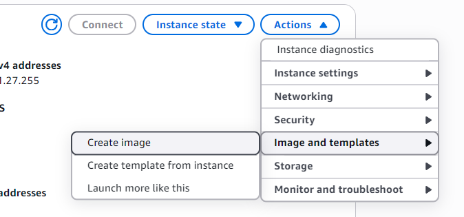
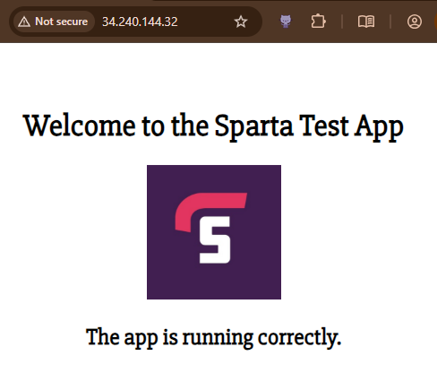
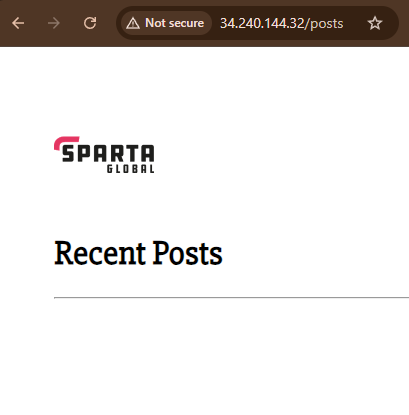
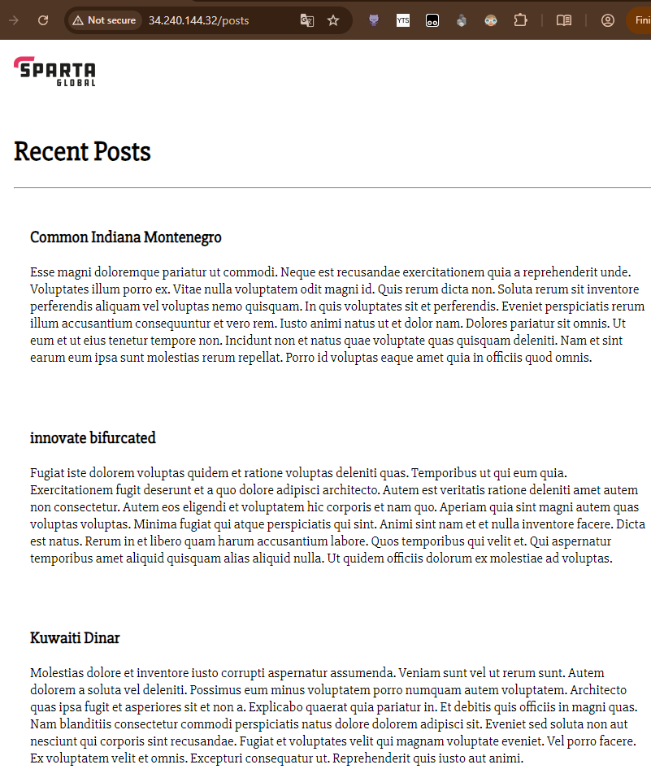

# Sparta DevOps Project – Containerised App Deployment <!-- omit from toc -->

- [Overview](#overview)
  - [Architecture](#architecture)
  - [The Sparta Test App](#the-sparta-test-app)
- [Setup Guide](#setup-guide)
  - [Docker](#docker)
    - [Sparta Test App](#sparta-test-app)
    - [Database](#database)
  - [Create AWS EC2 instance](#create-aws-ec2-instance)
  - [Install required software](#install-required-software)
    - [Docker](#docker-1)
    - [kubectl](#kubectl)
    - [minikube](#minikube)
  - [Create Amazon Machine Image (AMI)](#create-amazon-machine-image-ami)
  - [Create Sparta Test App EC2 instance](#create-sparta-test-app-ec2-instance)
  - [Kubernetes Deployments](#kubernetes-deployments)
    - [Install Kubernetes Metrics Server](#install-kubernetes-metrics-server)
    - [Create Kubernetes Persistent Volume](#create-kubernetes-persistent-volume)
    - [Create Kubernetes database deployment, service, and PVC](#create-kubernetes-database-deployment-service-and-pvc)
    - [Create Kubernetes Sparta Test App deployment and service](#create-kubernetes-sparta-test-app-deployment-and-service)
    - [Create Kubernetes Horizontal Pod Autoscaler](#create-kubernetes-horizontal-pod-autoscaler)
  - [Set up nginx reverse proxy](#set-up-nginx-reverse-proxy)
  - [Seed the database](#seed-the-database)
  - [Set up minikube automatic restart](#set-up-minikube-automatic-restart)
- [Testing](#testing)
  - [Automatic restarting](#automatic-restarting)
  - [Self-healing](#self-healing)

## Overview

This repo contains a user guide and configuration files to create a cloud-hosted deployment of a two-tier application, using Docker containerisation, Kubernetes orchestration, persistent volumes and automated horizontal scaling.

### Architecture

A single AWS EC2 instance is used to host all aspects of the application, including:

- An nginx reverse proxy for ingress to the Sparta app
- Installations of Docker, minikube and kubectl to run and manage the containerised components
- Kubernetes Metrics Server to provide data for autoscaling
- A Kubernetes persistent volume (PV) to preserve database data
- A Mongo database Kubernetes deployment and service, with a persistent volume claim (PVC) to the PV.
- A Sparta Test App Kubernetes deployment and service, connected to the Mongo database, with horizontal pod autoscaling in place.

<!-- INSERT DIAGRAM -->

### The Sparta Test App

The [Sparta Test App](https://github.com/LSF970/se-sparta-test-app) is a Node.js application features three endpoints that are used in this project:

- `/` - The main page of the app to test basic operation and connectivity.
- `/posts` - A page of posts from the database, to test connectivity to the database, seeding, and persistent data.
- `/fibonacci/<number>` - A page to easily generate application load by calculating Fibonacci numbers, to test horizontal autoscaling.

The application is accessed on port 3000.

## Setup Guide

### Docker

#### Sparta Test App

The following process was used to get local Sparta Test App files built into a Docker Image and published on Docker Hub. It assumes you have Docker installed and a Docker Hub account; replace `<Docker Hub username>` with your username if using this process:

- With the [Sparta Test App](https://github.com/LSF970/se-sparta-test-app) files in an `app` subdirectory, put the following `Dockerfile` in the parent directory:

  [`Dockerfile`](docker/Dockerfile)

  ```Dockerfile
  # from which image
  FROM node:20-alpine

  # label
  LABEL MAINTAINER="<e-mail address>"

  # set the default working directory to /usr/src/app
  WORKDIR /usr/src/app

  # copy app folder (to same place as Dockerfile, then copy to default location in container)
  COPY app /usr/src/app

  # install dependencies with npm
  RUN npm install

  # expose port
  EXPOSE 3000

  # CMD [node app.js or npm start]
  CMD [ "npm", "start" ]
  ```

- Build the application image with Docker:
  ```bash
  docker build -t <Docker Hub username>/sparta-test-app:v1 .
  ```
- Run the application locally on port 3000 and confirm OK:
  ```bash
  docker run --name sparta-app -d -p 3000:3000 <Docker Hub username>/sparta-test-app:v1
  ```
- Push the image to Docker Hub:
  ```bash
  docker push <Docker Hub username>/sparta-test-app:v1
  ```
- Delete local container and image (to force Docker to pull from Docker Hub):
  ```bash
  docker rm -f sparta-app
  docker rmi <Docker Hub username>/sparta-test-app:v1
  ```
- Run the application from Docker Hub image and confirm OK:
  ```bash
  docker run --name sparta-app -d -p 3000:3000 <Docker Hub username>/sparta-test-app:v1
  ```
  

The Docker image generated by the process above is available on [Docker Hub](https://hub.docker.com/r/mlewissparta/sparta-test-app/tags).

#### Database

The Sparta Test App requires a MongoDB database; the standard [mongo:7.0.6](https://hub.docker.com/layers/library/mongo/7.0.6) image was selected.

### Create AWS EC2 instance

This guide assumes the reader has (or can obtain) an AWS account and SSH key pair.

- Launch a new AWS EC2 instance with the following configuration:
  - AWS > EC2 > Launch instance
  - Name: `<user choice>-minikube`
  - AMI: Ubuntu Server 22.04 LTS (HVM), SSD Volume Type
  - Instance type: t3a.small
  - Key pair: `<existing AWS key pair>`
  - Network settings:
    - VPC, Subnet, Availability Zone: Default
    - Auto-assign public IP: Enable
    - Firewall (security groups): Create security group
    - Security group name: `<user choice>-minikube-sg`
    - Inbound Security Group Rules:
      - `TCP, 22, 0.0.0.0/0`
      - `TCP, 80, 0.0.0.0/0`

    

  - Configure storage: 1x `12` GiB
  - Launch instance

- Note down the Public IPv4 address of the new EC2 instance.

### Install required software

- Connect to the new EC2 instance via SSH:
  ```bash
  ssh -i ~/.ssh/<existing AWS key pair>.pem ubuntu@<EC2 IP address>
  ```
- Ensure system up to date:
  ```bash
  sudo apt update -y
  sudo apt upgrade -y
  sudo reboot now
  ```
- Reconnect via SSH:
  ```bash
  ssh -i ~/.ssh/<existing AWS key pair>.pem ubuntu@<EC2 IP address>
  ```

#### Docker

- Install Docker following the [standard instructions](https://docs.docker.com/engine/install/ubuntu/):
  ```bash
  sudo apt remove $(dpkg --get-selections docker.io docker-compose docker-compose-v2 docker-doc podman-docker containerd runc | cut -f1) # Ensure nothing installed
  sudo apt update
  sudo apt install ca-certificates curl
  sudo install -m 0755 -d /etc/apt/keyrings
  sudo curl -fsSL https://download.docker.com/linux/ubuntu/gpg -o /etc/apt/keyrings/docker.asc
  sudo chmod a+r /etc/apt/keyrings/docker.asc
  sudo tee /etc/apt/sources.list.d/docker.sources <<EOF
  Types: deb
  URIs: https://download.docker.com/linux/ubuntu
  Suites: $(. /etc/os-release && echo "${UBUNTU_CODENAME:-$VERSION_CODENAME}")
  Components: stable
  Signed-By: /etc/apt/keyrings/docker.asc
  EOF
  cat /etc/apt/sources.list.d/docker.sources
  sudo apt update
  sudo apt install docker-ce docker-ce-cli containerd.io docker-buildx-plugin docker-compose-plugin
  ```
- Check Docker is running:
  ```bash
  sudo systemctl status docker
  ```
- Allow Docker commands to be run without sudo:
  ```bash
  sudo usermod -aG docker $USER
  newgrp docker
  ```

#### kubectl

- Install kubectl following the [curl instructions](https://kubernetes.io/docs/tasks/tools/install-kubectl-linux/#install-kubectl-binary-with-curl-on-linux):
  ```bash
  curl -LO "https://dl.k8s.io/release/$(curl -L -s https://dl.k8s.io/release/stable.txt)/bin/linux/amd64/kubectl" # Download binary
  curl -LO "https://dl.k8s.io/release/$(curl -L -s https://dl.k8s.io/release/stable.txt)/bin/linux/amd64/kubectl.sha256" # Download checksum
  echo "$(cat kubectl.sha256)  kubectl" | sha256sum --check # Validate binary against checksum
  sudo install -o root -g root -m 0755 kubectl /usr/local/bin/kubectl # Install kubectl
  ```
- Check install:
  ```bash
  kubectl version --client
  ```
  Expected output format:
  ```
  Client Version: v1.35.1
  Kustomize Version: v5.7.1
  ```

#### minikube

- Install minikube following the [standard instructions](https://minikube.sigs.k8s.io/docs/start/?arch=%2Flinux%2Fx86-64%2Fstable%2Fbinary+download):
  ```bash
  curl -LO https://github.com/kubernetes/minikube/releases/latest/download/minikube-linux-amd64
  sudo install minikube-linux-amd64 /usr/local/bin/minikube && rm minikube-linux-amd64
  ```
- Start minikube:
  ```bash
  minikube start
  ```
- Confirm minkube install OK:
  ```bash
  kubectl get pods -A
  ```
  Expected output format:
  ```
  NAMESPACE     NAME                               READY   STATUS    RESTARTS        AGE
  kube-system   coredns-7d764666f9-9zpnb           1/1     Running   1 (5d21h ago)   5d21h
  kube-system   etcd-minikube                      1/1     Running   1 (5d21h ago)   5d21h
  kube-system   kube-apiserver-minikube            1/1     Running   1 (3m8s ago)    5d21h
  kube-system   kube-controller-manager-minikube   1/1     Running   1 (5d21h ago)   5d21h
  kube-system   kube-proxy-h7989                   1/1     Running   1 (5d21h ago)   5d21h
  kube-system   kube-scheduler-minikube            1/1     Running   1 (5d21h ago)   5d21h
  kube-system   storage-provisioner                1/1     Running   3 (63s ago)     5d21h
  ```

### Create Amazon Machine Image (AMI)

From the Instance summary page for the EC2 instance being worked on:

- Select: Actions > Image and templates > Create image
  
- Name: `<user choice>-minikube-image`
- Create image

This AMI with all Docker and Kubernetes required software can then be used for the Sparta Test App, and any other Kubernetes deployments on EC2 needed in future.

### Create Sparta Test App EC2 instance

- Create instance
  - AWS > EC2 > Launch instance
  - Name: `<user choice>-minikube-sparta`
  - AMI: `<user choice>-minikube-image` (created in prior task)
  - Instance type: t3a.small
  - Key pair: `<existing AWS key pair>`
  - Network settings:
    - VPC, Subnet, Availability Zone: Default
    - Auto-assign public IP: Enable
    - Firewall (security groups): Select existing security group
    - Common security groups: `<user choice>-minikube-sg`
  - Configure storage: 1x `12` GiB
  - Launch instance

- Connect to the new EC2 instance via SSH:
  ```bash
  ssh -i ~/.ssh/<existing AWS key pair>.pem ubuntu@<EC2 IP address>
  ```
- Start minikube:
  ```bash
  minikube start
  ```

### Kubernetes Deployments

❗The Kubenetes configuration YAML files referred to below can all be found in the [`kubernetes`](kubernetes) directory of this repository.

#### Install Kubernetes Metrics Server

Metrics Server collects resource data and is needed for autoscaling to function.

- Install and run Metrics Server:
  ```bash
  kubectl apply -f https://github.com/kubernetes-sigs/metrics-server/releases/latest/download/components.yaml
  ```
- As we do not have a signed certificate, disable certificate validation by passing `--kubelet-insecure-tls` to Metrics Server:
  ```bash
  kubectl patch deployment metrics-server -n kube-system \
  --type=json \
  -p='[{"op": "add", "path": "/spec/template/spec/containers/0/args/-", "value": "--kubelet-insecure-tls"}]'
  ```
- Check install:
  ```bash
  kubectl get deployment metrics-server -n kube-system
  ```
  Expected output:
  ```
  NAME             READY   UP-TO-DATE   AVAILABLE   AGE
  metrics-server   1/1     1            1           79s
  ```

#### Create Kubernetes Persistent Volume

- Create a Kubernetes configuration file in `~/sparta-k8s/` for a PV of 100 MiB:

  ```bash
  mkdir sparta-k8s
  nano sparta-k8s/sparta-db-pv.yml
  ```

  with the following content:

  [`sparta-db-pv.yml`](kubernetes/sparta-db-pv.yml)

  ```yaml
  apiVersion: v1
  kind: PersistentVolume
  metadata:
    name: sparta-db-pv
  spec:
    accessModes:
      - ReadWriteOnce
    capacity:
      storage: 100Mi
    storageClassName: standard
    hostPath:
      path: '/mnt/data'
  ```

- Create the PV:
  ```bash
  kubectl apply -f sparta-k8s/sparta-db-pv.yml
  ```
- Check PV created OK:
  ```bash
  kubectl get pv
  ```
  Expected output:
  ```
  NAME           CAPACITY   ACCESS MODES   RECLAIM POLICY   STATUS      CLAIM   STORAGECLASS   VOLUMEATTRIBUTESCLASS   REASON   AGE
  sparta-db-pv   100Mi      RWO            Retain           Available           standard       <unset>                          15s
  ```

#### Create Kubernetes database deployment, service, and PVC

- Create a Kubernetes configuration file in `~/sparta-k8s/` to:
  - Create a persistent volume claim to the PV just created
  - Create a ClusterIP service (as this does not allow access from outside the Kubernetes cluster)
  - Create a deployment for a single pod with the MongoDB image

  ```bash
  nano sparta-k8s/sparta-db-pvc-service-deploy.yml
  ```

  with the following content:

  [`sparta-db-pvc-service-deploy.yml`](kubernetes/sparta-db-pvc-service-deploy.yml)

  ```yaml
  apiVersion: v1
  kind: PersistentVolumeClaim
  metadata:
    name: sparta-db-pvc
  spec:
    accessModes:
      - ReadWriteOnce
    resources:
      requests:
        storage: 100Mi
    storageClassName: standard
    volumeName: sparta-db-pv
  ---
  apiVersion: v1
  kind: Service
  metadata:
    name: sparta-db-svc
  spec:
    type: ClusterIP
    ports:
      - port: 27017
        targetPort: 27017
    selector:
      app: sparta-db
  ---
  apiVersion: apps/v1
  kind: Deployment
  metadata:
    name: sparta-db-deployment
  spec:
    replicas: 1
    selector:
      matchLabels:
        app: sparta-db
    template:
      metadata:
        labels:
          app: sparta-db
      spec:
        volumes:
          - name: sparta-db-storage
            persistentVolumeClaim:
              claimName: sparta-db-pvc
        containers:
          - name: sparta-db
            image: mongo:7.0.6
            ports:
              - containerPort: 27017
            volumeMounts:
              - name: sparta-db-storage
                mountPath: /data/db
  ```

- Create the PVC, service, and deployment:
  ```bash
  kubectl apply -f sparta-k8s/sparta-db-pvc-service-deploy.yml
  ```
- Check all created OK:

  ```bash
  kubectl get pv,pvc,svc,deploy,pod
  ```

  Expected output:

  ```
  NAME                            CAPACITY   ACCESS MODES   RECLAIM POLICY   STATUS   CLAIM                   STORAGECLASS   VOLUMEATTRIBUTESCLASS   REASON   AGE
  persistentvolume/sparta-db-pv   100Mi      RWO            Retain           Bound    default/sparta-db-pvc   standard       <unset>                          22m

  NAME                                  STATUS   VOLUME         CAPACITY   ACCESS MODES   STORAGECLASS   VOLUMEATTRIBUTESCLASS   AGE
  persistentvolumeclaim/sparta-db-pvc   Bound    sparta-db-pv   100Mi      RWO            standard       <unset>                 20s

  NAME                     TYPE        CLUSTER-IP      EXTERNAL-IP   PORT(S)          AGE
  service/kubernetes       ClusterIP   10.96.0.1       <none>        443/TCP          5d23h
  service/sparta-db-svc    ClusterIP   10.110.62.246   <none>        27017/TCP        32s

  NAME                                    READY   UP-TO-DATE   AVAILABLE   AGE
  deployment.apps/sparta-db-deployment    1/1     1            1           36s

  NAME                                         READY   STATUS    RESTARTS   AGE
  pod/sparta-db-deployment-8f9578899-lw92j     1/1     Running   0          40s
  ```

  The output for the PV and PVC will show that these are linked (`STATUS: Bound`).

#### Create Kubernetes Sparta Test App deployment and service

- Create a Kubernetes configuration file in `~/sparta-k8s/` to:
  - Create a NodePort service, accessible inside the Kubernetes cluster on port 3000, and outside the cluster (but within the EC2 instance) on port 30001
  - Create a deployment for a pod with the Sparta Test App image

  ```bash
  nano sparta-k8s/sparta-app-service-deploy.yml
  ```

  with the following content (replace `<Docker Hub username>` with your username; the linked YAML file includes a working image):

  [`sparta-app-service-deploy.yml`](kubernetes/sparta-app-service-deploy.yml)

  ```yaml
  apiVersion: v1
  kind: Service
  metadata:
    name: sparta-app-svc
  spec:
    type: NodePort
    ports:
      - port: 3000
        targetPort: 3000
        nodePort: 30001
    selector:
      app: sparta-app
  ---
  apiVersion: apps/v1
  kind: Deployment
  metadata:
    name: sparta-app-deployment
  spec:
    selector:
      matchLabels:
        app: sparta-app
    template:
      metadata:
        labels:
          app: sparta-app
      spec:
        containers:
          - name: sparta-app
            image: <Docker Hub username>/sparta-test-app:v1
            ports:
              - containerPort: 3000
            resources:
              requests:
                cpu: 100m
            env:
              - name: DB_HOST
                value: mongodb://sparta-db-svc:27017/posts
  ```

- Create the service and deployment:
  ```bash
  kubectl apply -f sparta-k8s/sparta-app-service-deploy.yml
  ```
- Check NodePort service, deployment and pod created OK:

  ```bash
  kubectl get all
  ```

  Expected output:

  ```
  NAME                                         READY   STATUS    RESTARTS   AGE
  pod/sparta-app-deployment-84b5cc845f-sx6wb   1/1     Running   0          61s
  pod/sparta-db-deployment-8f9578899-lw92j     1/1     Running   0          25m

  NAME                     TYPE        CLUSTER-IP      EXTERNAL-IP   PORT(S)          AGE
  service/kubernetes       ClusterIP   10.96.0.1       <none>        443/TCP          5d23h
  service/sparta-app-svc   NodePort    10.99.38.53     <none>        3000:30001/TCP   61s
  service/sparta-db-svc    ClusterIP   10.110.62.246   <none>        27017/TCP        25m

  NAME                                    READY   UP-TO-DATE   AVAILABLE   AGE
  deployment.apps/sparta-app-deployment   1/1     1            1           61s
  deployment.apps/sparta-db-deployment    1/1     1            1           25m

  NAME                                               DESIRED   CURRENT   READY   AGE
  replicaset.apps/sparta-app-deployment-84b5cc845f   1         1         1       61s
  replicaset.apps/sparta-db-deployment-8f9578899     1         1         1       25m
  ```

#### Create Kubernetes Horizontal Pod Autoscaler

- Create a Kubernetes Horizontal Pod Autoscaler (HPA) configuration file in `~/sparta-k8s/` to limit the number of Sparta Test App pods to be minimum 2/maximum 10, and to scale based on CPU utilisation (as reported by the Metrics Server):

  ```bash
  nano sparta-k8s/sparta-app-hpa.yml
  ```

  with the following content:

  [`sparta-app-hpa.yml`](kubernetes/sparta-app-hpa.yml)

  ```yaml
  apiVersion: autoscaling/v2
  kind: HorizontalPodAutoscaler
  metadata:
    name: sparta-app-hpa
  spec:
    scaleTargetRef:
      apiVersion: apps/v1
      kind: Deployment
      name: sparta-app-deployment
    minReplicas: 2
    maxReplicas: 10
    metrics:
      - type: Resource
        resource:
          name: cpu
          target:
            type: Utilization
            averageUtilization: 50
  ```

- Create the HPA:
  ```bash
  kubectl apply -f sparta-k8s/sparta-app-hpa.yml
  ```
- Check HPA and pods:

  ```bash
  kubectl get hpa,pod
  ```

  Expected output:

  ```
  NAME                                                 REFERENCE                          TARGETS       MINPODS   MAXPODS   REPLICAS   AGE
  horizontalpodautoscaler.autoscaling/sparta-app-hpa   Deployment/sparta-app-deployment   cpu: 1%/50%   2         10        2          2m38s

  NAME                                         READY   STATUS    RESTARTS   AGE
  pod/sparta-app-deployment-84b5cc845f-sx6wb   1/1     Running   0          30m
  pod/sparta-app-deployment-84b5cc845f-wrlns   1/1     Running   0          2m23s
  pod/sparta-db-deployment-8f9578899-lw92j     1/1     Running   0          54m
  ```

  This will show that the number of app pods has increased to the minimum (2) and that the HPA is linked to current CPU usage (1% in the output above).

### Set up nginx reverse proxy

- Install nginx on the EC2 instance:
  ```bash
  sudo apt install nginx -y
  ```
- Get the internal URL of the Sparta Test App service:
  ```bash
  minikube service sparta-app-svc --url
  ```
  Expected output:
  ```
  http://<IP address>:30001
  ```
- Edit ngnix config to add a reverse proxy to the IP address given by `minikube service`:
  ```bash
  sudo sed -i '51c\proxy_pass http://<IP address from minikube service>:30001;' /etc/nginx/sites-available/default
  ```
- Restart nginx to apply the new configuration:
  ```bash
  sudo systemctl restart nginx
  ```
- Confirm the app is now available at `http://<public IP address>`, with `http://<public IP address>/posts` working (but showing an empty posts list).

   

### Seed the database

Seeding the database requires running the seeding command on one of the Sparta Test App pods.

- Get the IDs of the Sparta Test App pods:

  ```bash
  kubectl get pod -l app=sparta-app
  ```

  Expected output:

  ```
  NAME                                     READY   STATUS    RESTARTS   AGE
  sparta-app-deployment-84b5cc845f-sx6wb   1/1     Running   0          69m
  sparta-app-deployment-84b5cc845f-wrlns   1/1     Running   0          41m
  ```

- Pass the command to seed the database to one of the pods using its full alphanumeric ID in the previous output:

  ```bash
  kubectl exec -it pod/sparta-app-deployment-<pod-id> -- npm run postinstall
  ```

  Expected output:

  ```
  > sparta-test-app@1.0.1 postinstall
  > node seeds/seed.js

  Connected to database
  Database cleared
  Database seeded with 100 records
  Database connection closed
  ```

- Confirm that `http://<public IP address>/posts` is now populated with posts:

  

### Set up minikube automatic restart

As standard, `minikube start` must be run after the instance restarts to make the app available. systemd can be used to ensure that minikube starts automatically.

- Create a systemd service file for minikube:

  ```bash
  sudo nano /etc/systemd/system/minikube.service
  ```

  with the following content:

  `minikube.service`

  ```
  [Unit]
  Description=Minikube Start Service
  After=docker.service

  [Service]
  Type=oneshot
  RemainAfterExit=yes
  User=ubuntu
  Group=ubuntu
  ExecStart=/usr/local/bin/minikube start
  ExecStop=/usr/local/bin/minikube stop

  [Install]
  WantedBy=multi-user.target
  ```

  Apply the new config and ensure it runs on restart:

  ```bash
  sudo systemctl daemon-reload
  sudo systemctl enable minikube.service
  ```

## Testing

### Automatic restarting

This was tested by stopping the EC2 instance from the AWS instance summary page, then starting it again after several minutes. The instance was given a new public IP address at this time.

The Sparta Test App could be reached in a browser, and `kubectl get pods` could be successfully run from the instance's command line, showing that minikube was starting automatically on restart.

### Self-healing

This was tested by deleting an application pod and confirming it was replaced.

- Get all Sparta Test App pods running:
  ```bash
  kubectl get pod -l app=sparta-app
  ```
  Output:
  ```
  NAME                                     READY   STATUS    RESTARTS        AGE
  sparta-app-deployment-84b5cc845f-njtq6   1/1     Running   0               3m30s
  sparta-app-deployment-84b5cc845f-qwsp2   1/1     Running   0               3m30s
  ```
- Delete one of the pods:
  ```bash
  kubectl delete pod sparta-app-deployment-84b5cc845f-qwsp2
  ```
  Output:
  ```
  pod "sparta-app-deployment-84b5cc845f-qwsp2" deleted from default namespace
  ```
- Refresh the list of running pods:
  ```bash
  kubectl get pod -l app=sparta-app
  ```
  Output:
  ```
  NAME                                     READY   STATUS    RESTARTS        AGE
  sparta-app-deployment-84b5cc845f-cwv4p   1/1     Running   0               8s
  sparta-app-deployment-84b5cc845f-njtq6   1/1     Running   0               4m49s
  ```

A new pod has been automatically started to meet the minimum number of replicas running, following the deletion of an existing pod, showing that the self-healing functionality is working.

<!--

### Persistent data

### Autoscaling

- Load testing
  - Accessed `http://<EC2 external IP>/fibonacci/1` (and higher numbers) to generate load
  - With `kubectl get hpa`, CPU increase and resultant increase in replicas observed.

## Commentary

Contribution guidelines for future developers

Blockers – Suggestion: what was the issue, reason for the issue, solution

What you learnt

Benefits you saw personally from the project -->
